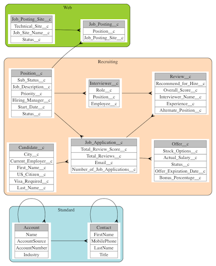

Graphviz Force
========

An Entity Relationship Diagram generator in [Graphviz](http://graphviz.org) format for Salesforce.com. 
Graphviz is a free tool that converts text files into diagrams. Those text files are what this tool generates automatically.

This is an example of what you can produce.

###Features
- Automatically generate and layout diagrams from SFDC to Graphviz
- Group entities and choose which fields are included
- Save diagrams for later changes
- Export diagrams to [Image](assets/Recruiting+and+Standard.png) or [PDF](assets/Recruiting+and+Standard.pdf?raw=true) using Graphviz
- Customise the templates used for the diagram for your style preferences

###Getting Started

Install [Graphviz](http://graphviz.org) on your computer.

Install this app into your Salesforce: 
<a href="https://githubsfdeploy-sandbox.herokuapp.com/app/githubdeploy/stevebuik/GraphVizForce" target="deploy">Install into Sandbox</a>
.....or..... 
<a href="https://githubsfdeploy.herokuapp.com/app/githubdeploy/stevebuik/GraphVizForce" target="deploy">Install into Production</a>

Create a folder in the Documents tab called *ERD Settings* . This name is case sensitive. The API Name of the folder can be anything.

To run the generator, navigate to the ERD Generator tab. You may need to make the tab visible in your Profile. 
Or just change the url in your browser to /apex/ERDGeneratorPage

1. Click the *Generate* button to see the diagram.
2. Now add some new fields to the diagram
	2. Click the *Configure Objects* tab
	3. Edit any object and choose the fields you want to see
	4. Click *Generate* again to update the diagram
3. Click the *Configure Groups* tab to add or remove a Group and some Objects
4. Click *Generate* again to see your changes in the Graphviz code field	
5. Use the *Save* button to save your diagram. This allows you to update it later without starting from scratch.
6. Maybe use the *Save As* button in the *Choose/Create Diagram* tab to clone a new Diagram from the default.

###Templates

Diagrams are generated using a template system. Templates are *Static Resources* that have a description starting with #graphviztemplate. 
You can also use a template that is in a public Dropbox folder. The file must have a .gv extension. 
This is useful when changing templates because you can edit the file locally and Dropbox will automatically save it to the cloud.
If you are a developer you can use Eclipse or any other meta-data editor to create/edit Static Resources instead of using Dropbox.

Note: to use a Dropbox template, you must add a *Remote Site Setting* in Salesforce for https://dl.dropboxusercontent.com

This means you can create custom templates if you want or you can just use the basic included template(s).
If you create a nice template, please send us a sample - we'd like to include it for everyone to use. 

For more info on Graphviz syntax see http://www.graphviz.org/Documentation/dotguide.pdf

The easiest way to play with templates is to generate a diagram and open it in Graphviz. 
Then edit the .gv in any editor and Graphviz will automatically refresh. Once you are happy with the design, apply the changes to your template and re-generate.

###Motivation

This tool was not possible using Apex until the Summer 14 Release when Salesforce removed the limits on describes.

We built it to enable anyone to generate ERD Diagrams and to share what we've learned building tools like this. 

The code is split into modules to make it easier to understand for developers. 
There are a few techniques used in the code which you can copy and learn from:

- Dropbox File Chooser without OAuth [ERDGeneratorJS](https://github.com/stevebuik/GraphVizForce/blob/master/src/staticresources/ERDGeneratorJS.resource)
- Template generation from any data [TemplateEngine](https://github.com/stevebuik/GraphVizForce/blob/master/src/classes/TemplateEngine.cls)
- JQuery-UI widgets wrapped in a Visualforce Component [JQuerySelectable](https://github.com/stevebuik/GraphVizForce/blob/master/src/components/JQuerySelectable.component)
- Automatically upgraded saved Settings [ERDPersister](https://github.com/stevebuik/GraphVizForce/blob/master/src/classes/ERDPersister.cls) 

Look at the tests to learn how to use these classes.

###Roadmap

We welcome contributions from the community. If you want to add a feature, connect with one of us to ensure that someone else is not already doing it and then send us a pull request.

Here are features that we need help with
- More Templates
- Lightning Component for the JQuery Selectable
- Connecting Relationships to the correct Field using dot *ports*
- Displaying relationship types (Master Detail vs Lookup)
- Displaying relationship names
  
### Contributors

Jason Guan [Github](https://github.com/jasong327) [LinkedIn](https://www.linkedin.com/pub/jason-guan/39/3a9/346) [Website](http://cyberlemons.com/)

Steve Buikhuizen [@stevebuik](https://twitter.com/stevebuik) [Github](https://github.com/stevebuik) [LinkedIn](https://www.linkedin.com/in/stevebuikhuizen) [Google+](https://plus.google.com/+SteveBuikhuizen)